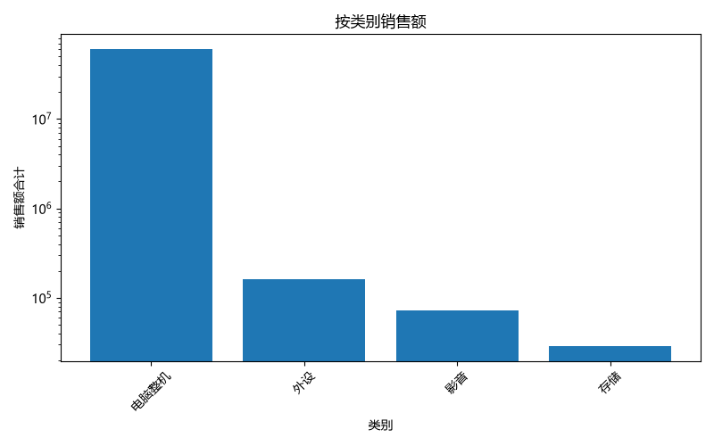

# 实习练习-销售脏数据 数据分析报告

## 按类别销售额

## AI 分析洞察

从整体销售数据来看，公司业绩表现强劲，但存在明显的集中趋势。销售额最高的月份是2026年8月，贡献了绝大部分收入，而7月销售相对平淡，说明业务可能存在季节性波动或受特定促销活动影响。产品类别中，电脑整机是绝对主力，销售额远超其他类别，而外设、影音和存储产品的贡献较小，建议在保持电脑整机优势的同时，探索其他品类的增长机会。地区方面，华南地区销售额遥遥领先，其他地区如华中、华东等虽有贡献但差距较大，未来可考虑加强非华南地区的市场开拓。销售员表现差异显著，刘强的销售额占绝对主导，其他销售员贡献有限，建议分析刘强的成功经验并推广，同时提升团队整体销售能力。总体而言，公司应继续巩固核心产品和优势区域，同时优化产品结构和区域布局，以实现更均衡的发展。

---

## 描述性统计

|   数量_数字 |   单价_数字 |           销售额_数字 |
|--------:|--------:|-----------------:|
|   63    |   63    |     62           |
|  168    | 1445.83 | 979891           |
| 1258.58 | 2144.17 |      7.61641e+06 |
|    1    |   79    |    158           |
|    3    |  299    |   1118           |
|   10    |  499    |   4150           |
|   12    | 1299    |  12990           |
| 9999    | 5999    |      5.9984e+07  |

## 按类别汇总

| 类别   |            销售额合计 |
|:-----|-----------------:|
| 电脑整机 |      6.04939e+07 |
| 外设   | 160080           |
| 影音   |  72725           |
| 存储   |  28777           |

## 按地区汇总

| 地区   |            销售额合计 |
|:-----|-----------------:|
| 华南   |      6.00551e+07 |
| 华中   | 307277           |
| 华东   | 166013           |
| 西南   | 119481           |
| 华北   | 108025           |

## 按销售员汇总

| 销售员   |            销售额合计 |
|:------|-----------------:|
| 刘强    |      6.01834e+07 |
| 王芳    | 211093           |
| 张伟    | 114666           |
| 赵磊    | 104833           |
| 陈静    |  95301           |
| 李娜    |  47218           |

## 按月份汇总

| 月份      |          销售额合计 |
|:--------|---------------:|
| 2026-08 |      6.047e+07 |
| 2026-07 | 283208         |

